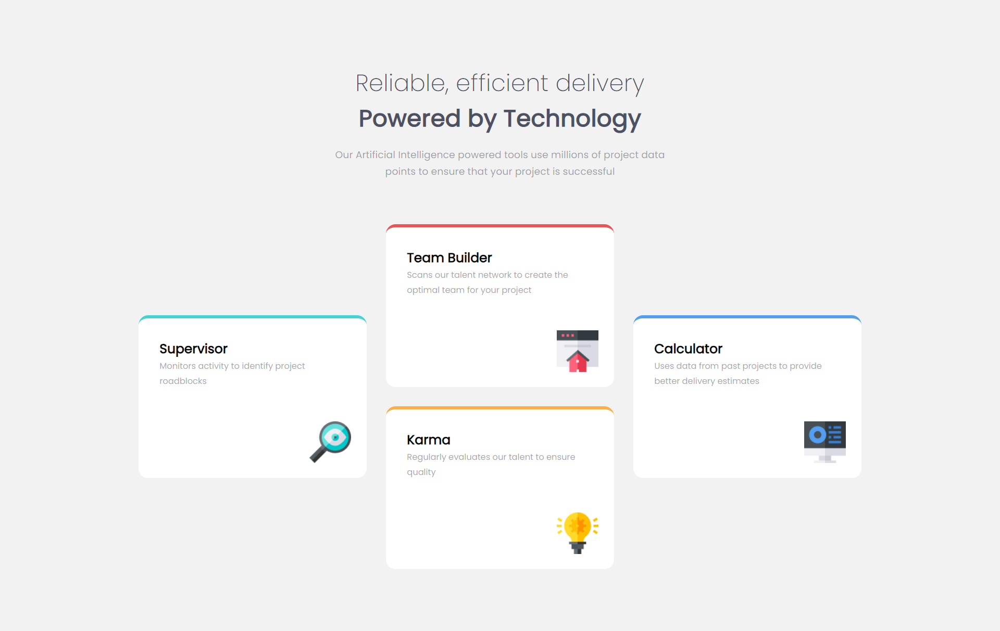

# Four Card Feature Landing Page

This is a basic web page design featuring four cards. The landing page is designed to be responsive, ensuring a seamless experience across various devices and screen sizes.

# Features

- Responsive Design 
  The web page is designed to be responsive and adapt to different screen sizes, ensuring a seamless user experience across devices

- Eye-catching Cards 
  The four cards are designed to grab the user's attention with visually appealing images and concise descriptions

# Usage

To use this design, simply download the source code and customize it according to your needs. You can modify the content, images, colors, and styles to match your brand or project requirements.

# Review Our Web Page

If you have a moment, we would greatly appreciate your feedback on our work. 
Please take a moment to review our webpage at [Link](). 
Your time and insights are highly valued. 
Thank you.

